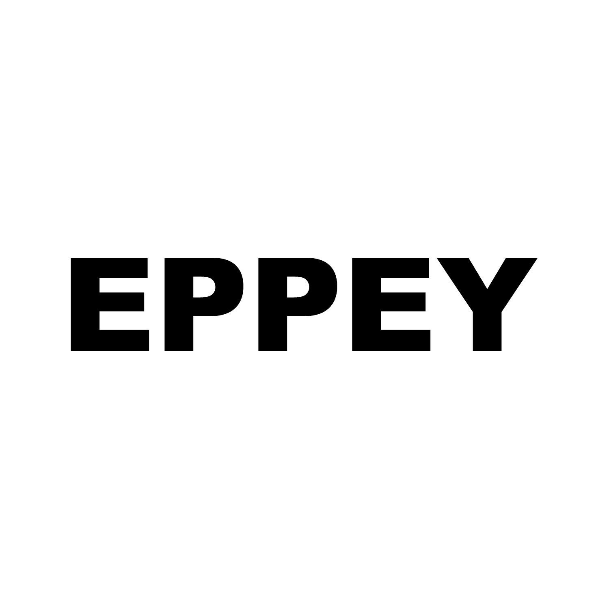

<div id="top"></div>

<!-- PROJECT SHIELDS -->

[![Contributors][contributors-shield]][contributors-url]
[![Forks][forks-shield]][forks-url]
[![Stargazers][stars-shield]][stars-url]
[![Issues][issues-shield]][issues-url]
[![CC BY-NC-ND 4.0 License][license-shield]][license-url]
[![LinkedIn][linkedin-shield]][linkedin-url]

<!-- PROJECT LOGO -->
<br />
<div align="center">
  <a href="https://github.com/Eppey/eppey">
    
  </a>

  <h3 align="center">EPPEY</h3>

  <p align="center">
    Anonymous Network for International Students
    <br />
    <a href="https://github.com/Eppey/eppey"><strong>Explore the docs »</strong></a>
    <br />
    <br />
    <a href="https://youtu.be/MAJ0ASmUa_c">View Demo</a>
    ·
    <a href="https://github.com/Eppey/eppey/issues">Report Bug</a>
    ·
    <a href="https://github.com/Eppey/eppey/issues">Request Feature</a>
  </p>
</div>

<!-- TABLE OF CONTENTS -->
<details>
  <summary>Table of Contents</summary>
  <ol>
    <li>
      <a href="#about-the-project">About The Project</a>
      <ul>
        <li><a href="#built-with">Built With</a></li>
      </ul>
    </li>
    <li>
      <a href="#getting-started">Getting Started</a>
      <ul>
        <li><a href="#prerequisites">Prerequisites</a></li>
        <li><a href="#installation">Installation</a></li>
      </ul>
    </li>
    <li><a href="#usage">Usage</a></li>
    <li><a href="#roadmap">Roadmap</a></li>
    <li><a href="#contributing">Contributing</a></li>
    <li><a href="#license">License</a></li>
    <li><a href="#contact">Contact</a></li>
    <li><a href="#acknowledgments">Acknowledgments</a></li>
  </ol>
</details>

<!-- ABOUT THE PROJECT -->

## About The Project

[![Product Name Screen Shot][product-screenshot]](https://example.com)

**Why is there no well-known community where international students can discuss anonymously?**

International Students attending US colleges often struggle with collecting information due to the lack of an existing social networking platform in the current market. EPPEY provides an anonymous community where international students can freely share their opinions and helpful information.

<p align="right">(<a href="#top">back to top</a>)</p>

### Built With

- Frontend
  - [React Native](https://reactnative.dev)
- Backend
  - [AWS AppSync](https://aws.amazon.com/appsync/)
  - [GraphQL](https://graphql.org)
  - [AWS Lambda](https://aws.amazon.com/lambda/)
  - [AWS DynamoDB](https://aws.amazon.com/dynamodb/)
- CI/CD
  - [AWS Amplify](https://aws.amazon.com/amplify/)

<p align="right">(<a href="#top">back to top</a>)</p>

<!-- GETTING STARTED -->

## Getting Started

### Prerequisites

- [npm](https://www.npmjs.com/)
  ```sh
  npm install -g npm@latest
  ```
- [expo](https://docs.expo.dev)
  ```sh
  npm install -g expo-cli
  ```
- [amplify-cli](https://docs.amplify.aws/cli/start/install/)
  ```sh
  npm install -g @aws-amplify/cli
  ```
- [EPPEY IAM user credentials](https://aws.amazon.com/iam/)

### Installation

1. Clone the repo
   ```sh
   git clone https://github.com/Eppey/eppey.git
   ```
2. Install NPM packages
   ```sh
   npm install
   ```
3. Pull from AWS Amplify
   ```sh
   amplify pull
   ```
4. Start your own local server and run in iOS/Android simulator or web
   ```sh
   npm start
   ```

<p align="right">(<a href="#top">back to top</a>)</p>

<!-- USAGE EXAMPLES -->

## Usage

Working on it

<p align="right">(<a href="#top">back to top</a>)</p>

<!-- ROADMAP -->

## Roadmap

- [x] Design App structure & workflow
- [x] Frontend (React Native)
  - [x] Auth
    - [x] Sign-up/in
    - [x] Password Reset
  - [ ] Main
    - [x] Home Screen
    - [x] Search
    - [x] Write Post
    - [ ] Notification
    - [x] My Page (Profile)
  - [ ] My Page
    - [x] Profile
    - [x] Posts/Comments/Bookmarks
    - [ ] Settings
    - [ ] Updates
    - [x] Feedbacks
- [x] Backend (AWS)
  - [x] Auth (Cognito)
  - [x] Database (DynamoDB)
  - [x] GraphQL API (Appsync)
  - [x] Analytics (Pinpoint)
  - [x] Storage (S3)
  - [x] Hosting (Amplify)
  - [x] Functions/Resolvers (Lambda)
- [x] Multi-language Support
  - [x] English
  - [x] Korean

See the [open issues](https://github.com/Eppey/eppey/issues) for a full list of proposed features (and known issues).

<p align="right">(<a href="#top">back to top</a>)</p>

<!-- CONTRIBUTING -->

## Contributing

Contributions are what make the open source community such an amazing place to learn, inspire, and create. Any contributions you make are **greatly appreciated**.

If you have a suggestion that would make this better, please fork the repo and create a pull request. You can also simply open an issue with the tag "enhancement".
Don't forget to give the project a star! Thanks again!

1. Fork the Project
2. Create your Feature Branch (`git checkout -b feature/AmazingFeature`)
3. Commit your Changes (`git commit -m 'Add some AmazingFeature'`)
4. Push to the Branch (`git push origin feature/AmazingFeature`)
5. Open a Pull Request

<p align="right">(<a href="#top">back to top</a>)</p>

<!-- LICENSE -->

## License

Distributed under the CC BY-NC-ND 4.0 License. See `LICENSE.txt` for more information.

<p align="right">(<a href="#top">back to top</a>)</p>

<!-- CONTACT -->

## Contact

- Hwuiwon Kim - [hueyk](http://linkedin.com/in/hueyk/) - hkim@gatech.edu
- Sehoan Choi - [sehoanchoi](https://www.linkedin.com/in/sehoanchoi/) - sehoanchoi0124@gmail.com

<p align="right">(<a href="#top">back to top</a>)</p>

<!-- ACKNOWLEDGMENTS -->

## Acknowledgments

- [coolicons](https://www.figma.com/community/file/800815864899415771)
- [Figma iOS UI Kit](https://www.figma.com/community/file/809487622678629513)
- [Mockupy - Cute 3D Device Mockup](https://www.figma.com/community/file/1052097126940064675)

<p align="right">(<a href="#top">back to top</a>)</p>

<!-- MARKDOWN LINKS & IMAGES -->
<!-- https://www.markdownguide.org/basic-syntax/#reference-style-links -->

[contributors-shield]: https://img.shields.io/github/contributors/Eppey/eppey.svg?style=for-the-badge
[contributors-url]: https://github.com/Eppey/eppey/graphs/contributors
[forks-shield]: https://img.shields.io/github/forks/Eppey/eppey.svg?style=for-the-badge
[forks-url]: https://github.com/Eppey/eppey/network/members
[stars-shield]: https://img.shields.io/github/stars/Eppey/eppey.svg?style=for-the-badge
[stars-url]: https://github.com/Eppey/eppey/stargazers
[issues-shield]: https://img.shields.io/github/issues/Eppey/eppey?style=for-the-badge
[issues-url]: https://github.com/Eppey/eppey/issues
[license-shield]: https://img.shields.io/badge/license-CC%20BY--NC--ND%204.0-green?style=for-the-badge
[license-url]: https://github.com/Eppey/eppey/blob/main/LICENSE.md
[linkedin-shield]: https://img.shields.io/badge/-LinkedIn-black.svg?style=for-the-badge&logo=linkedin&colorB=555
[linkedin-url]: https://www.linkedin.com/company/eppey/
[product-screenshot]: assets/images/workflow.png
